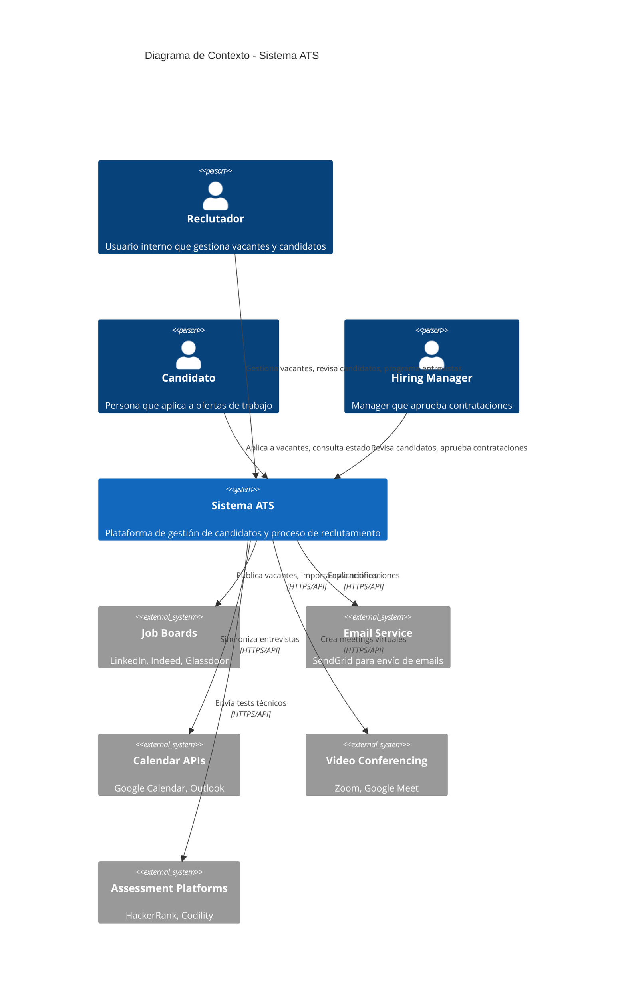
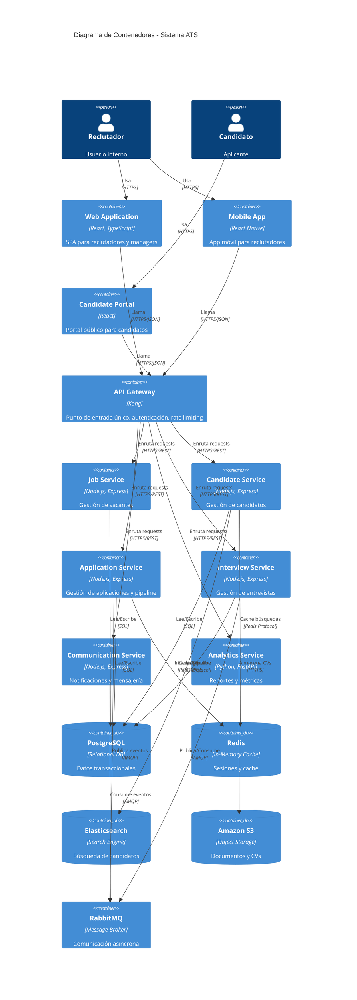
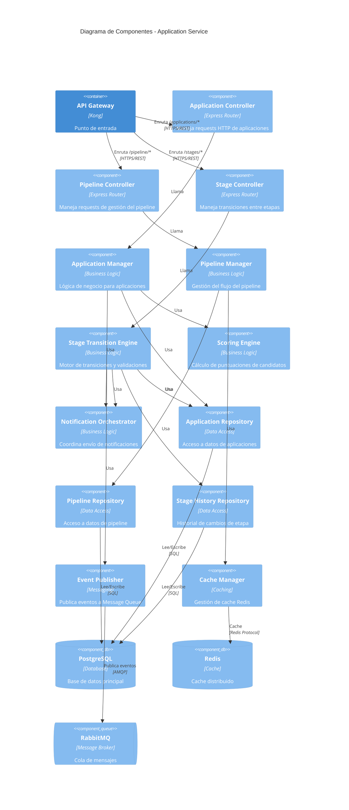
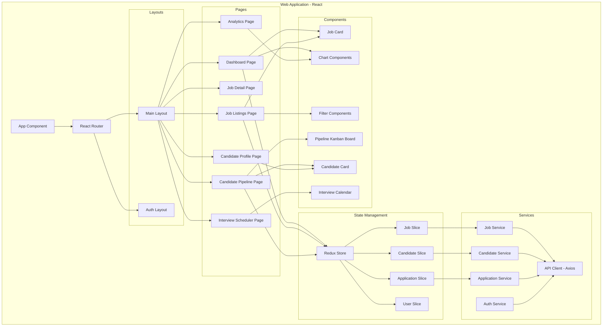
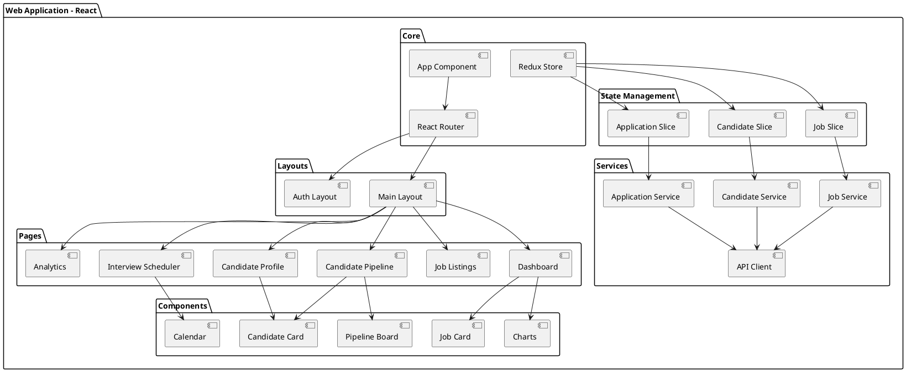
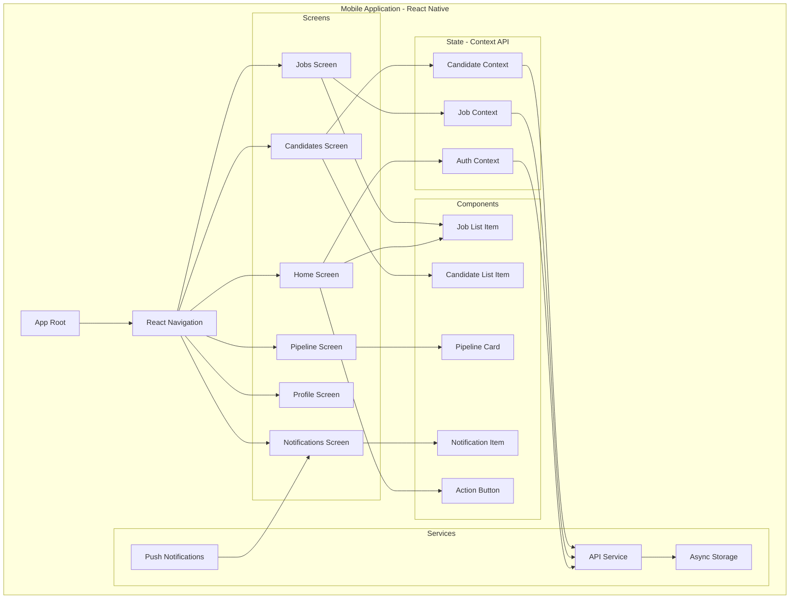
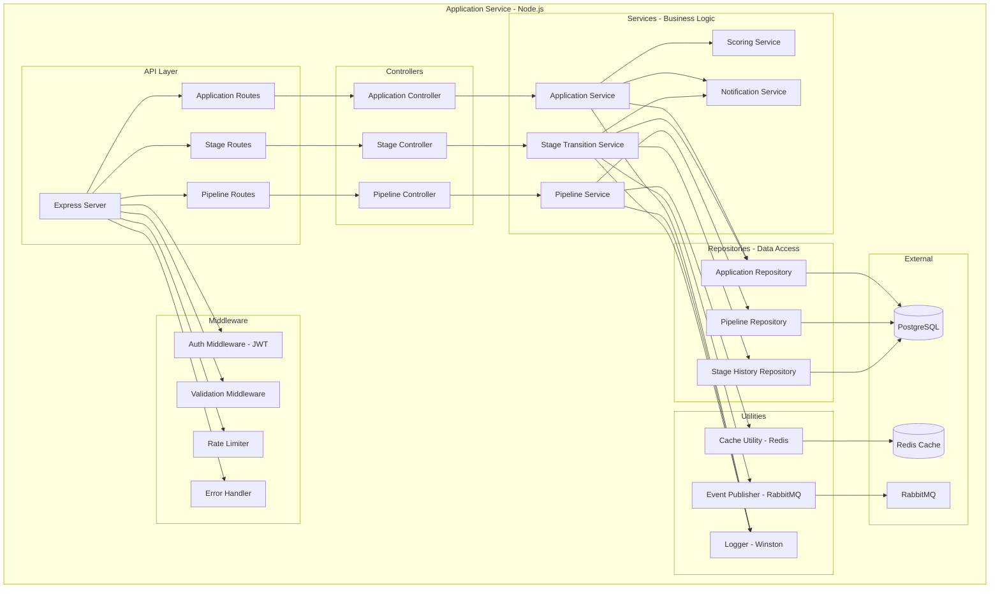
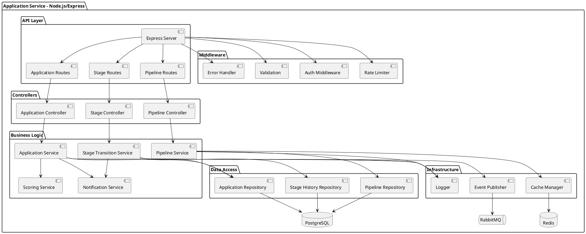
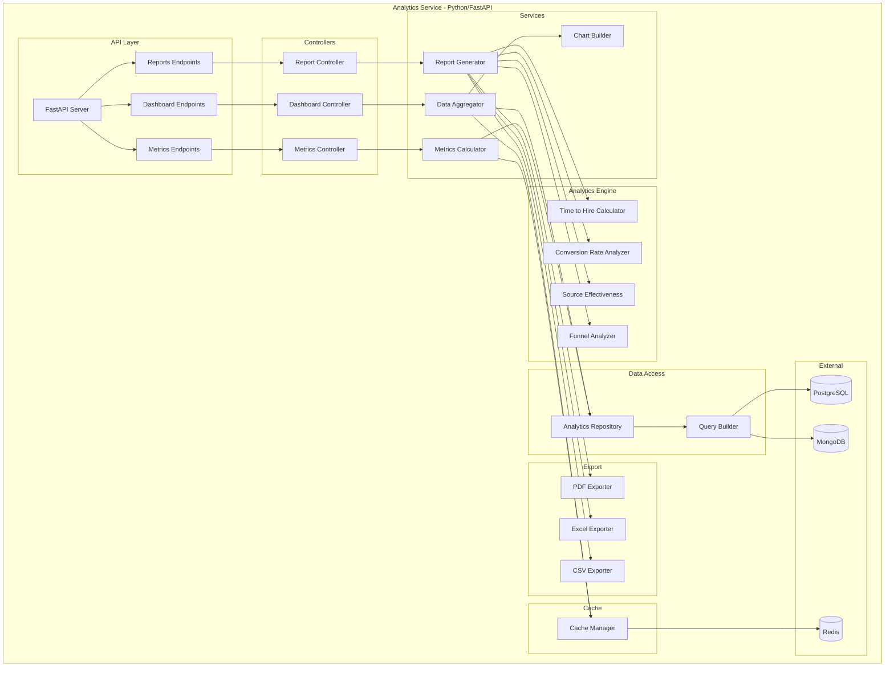
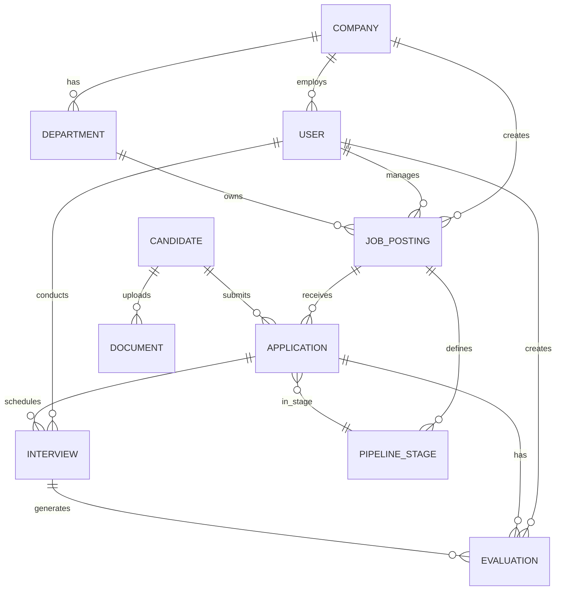

Sistema de Gestión de Candidatos (ATS) - LTI
1. Descripción del Sistema
El Applicant Tracking System (ATS) de LTI es una plataforma integral de gestión de candidatos diseñada para optimizar y automatizar el proceso completo de reclutamiento y selección de personal. El sistema centraliza todas las etapas del ciclo de contratación, desde la creación de ofertas de trabajo hasta la incorporación final de los candidatos seleccionados.
La plataforma permite a los equipos de recursos humanos gestionar múltiples procesos de selección simultáneamente, colaborar eficientemente entre reclutadores y managers, realizar seguimiento en tiempo real del estado de cada candidatura, y tomar decisiones basadas en datos mediante análisis y reportes automatizados. El sistema está diseñado con una arquitectura moderna, escalable y orientada a mejorar significativamente la experiencia tanto de los reclutadores como de los candidatos.

2. Valor Añadido y Ventajas Competitivas
Valor Añadido

Automatización Inteligente: Reducción del 60% del tiempo dedicado a tareas administrativas mediante flujos de trabajo automatizados y notificaciones inteligentes
Experiencia del Candidato Mejorada: Portal personalizado que mantiene a los candidatos informados en cada etapa, mejorando la marca empleadora
Colaboración en Tiempo Real: Herramientas de comunicación integradas que facilitan la toma de decisiones colaborativa entre equipos
Analytics Avanzado: Dashboards interactivos con métricas clave de reclutamiento (time-to-hire, cost-per-hire, fuente de candidatos más efectiva)
Cumplimiento Normativo: Gestión automatizada del cumplimiento con regulaciones laborales y de protección de datos (GDPR, EEOC)

Ventajas Competitivas

Integración Nativa Multi-canal: Publicación automática en más de 50 job boards, redes sociales y plataformas especializadas con un solo clic
AI-Powered Matching: Algoritmos de inteligencia artificial que pre-filtran y ranquean candidatos según compatibilidad con el puesto
Personalización Total: Sistema altamente configurable que se adapta a los procesos específicos de cada organización sin desarrollo custom
Mobile-First Design: Aplicación móvil completa que permite gestionar candidatos desde cualquier lugar
Pricing Disruptivo: Modelo de precios por usuario activo, no por número de puestos publicados, reduciendo costos hasta un 40% vs competidores
Onboarding Integrado: Transición fluida del candidato seleccionado al proceso de incorporación sin cambiar de plataforma
API Abierta: Ecosistema de integraciones con HRIS, herramientas de assessment, plataformas de video-entrevistas y más


3. Funcionalidades Principales (Ordenadas por Prioridad)
Prioridad Crítica (P0)

Gestión de Vacantes y Publicación de Empleos

Creación y edición de ofertas de trabajo con plantillas personalizables
Publicación multi-canal automática en job boards integrados
Gestión del estado y ciclo de vida de las vacantes


Recepción y Almacenamiento de Aplicaciones

Formularios de aplicación personalizables
Parsing automático de CVs (extracción de datos estructurados)
Base de datos centralizada de candidatos con búsqueda avanzada


Pipeline de Candidatos y Seguimiento

Visualización tipo Kanban del estado de candidatos por etapa
Drag & drop para mover candidatos entre etapas del proceso
Historial completo de interacciones y actividades por candidato


Comunicación con Candidatos

Plantillas de email personalizables para cada etapa
Envío automático de notificaciones de estado
Portal del candidato para seguimiento de su aplicación


Prioridad Alta (P1)

Gestión de Entrevistas

Calendario integrado para agendar entrevistas
Invitaciones automáticas con sincronización de calendarios (Google, Outlook)
Scorecards y formularios de evaluación estructurados


Evaluaciones y Tests Online

Biblioteca de tests técnicos y psicométricos
Integración con plataformas de assessment externas
Registro automático de resultados en el perfil del candidato


Colaboración entre Equipos

Sistema de comentarios y notas privadas/compartidas
Permisos y roles personalizables (Admin, Recruiter, Hiring Manager, Interviewer)
Flujos de aprobación configurables


Reportes y Analytics

Dashboard con KPIs de reclutamiento en tiempo real
Reportes de funnel de conversión por vacante
Análisis de fuentes de candidatos y su efectividad


Prioridad Media (P2)

Automatización de Workflows

Reglas automáticas para movimientos de candidatos
Triggers y acciones personalizables
Secuencias de email automatizadas


Talent Pool y Database de Candidatos

Segmentación y etiquetado de candidatos
Búsqueda semántica avanzada con filtros múltiples
Candidatos silver medalists para futuras vacantes


Integración con Job Boards y Redes Sociales

Conexión nativa con LinkedIn, Indeed, Glassdoor, etc.
Importación automática de candidatos de diferentes fuentes
Tracking de origen de cada aplicación


Compliance y Gestión Documental

Almacenamiento seguro de documentos
Workflows de consentimiento y firma electrónica
Auditoría de acciones y cumplimiento GDPR


Prioridad Baja (P3)

Employer Branding

Página de carreras personalizable
Micrositios por departamento o ubicación
Integración con redes sociales para compartir vacantes


Onboarding de Empleados

Transición automática de candidato seleccionado a empleado
Checklists de onboarding
Gestión de documentación pre-incorporación


Mobile App

Aplicación nativa iOS/Android para reclutadores
Notificaciones push en tiempo real
Funcionalidades core disponibles offline


4. Casos de Uso Principales
4.1 Caso de Uso 1: Publicación y Gestión de Vacante
Descripción: Un reclutador crea una nueva vacante, la configura con todos los requisitos necesarios y la publica en múltiples canales para comenzar a recibir aplicaciones.
Actores:

Reclutador (principal)
Hiring Manager (secundario)
Sistema ATS

Flujo Principal:

El reclutador inicia sesión en el sistema
Accede al módulo de creación de vacantes
Completa los detalles de la posición (título, descripción, requisitos, salario, ubicación)
Configura las etapas del proceso de selección
Selecciona los canales de publicación (job boards, redes sociales)
El Hiring Manager revisa y aprueba la vacante
El sistema publica automáticamente en todos los canales seleccionados
Se activa el seguimiento de aplicaciones para esa vacante

Flujo Alternativo:

Si el Hiring Manager rechaza, el reclutador realiza ajustes y reenvía para aprobación

Diagrama PlantUML:
plantuml@startuml
actor Reclutador
actor "Hiring Manager" as HM
participant "Sistema ATS" as ATS
database "Base de Datos" as DB
participant "Job Boards API" as JB

Reclutador -> ATS: Iniciar sesión
activate ATS

Reclutador -> ATS: Crear nueva vacante
ATS -> ATS: Mostrar formulario

Reclutador -> ATS: Completar detalles de posición
Reclutador -> ATS: Configurar etapas de selección
Reclutador -> ATS: Seleccionar canales de publicación

Reclutador -> ATS: Enviar para aprobación
ATS -> DB: Guardar vacante (estado: pendiente)
ATS -> HM: Notificar para revisión

HM -> ATS: Revisar vacante
alt Vacante aprobada
    HM -> ATS: Aprobar vacante
    ATS -> DB: Actualizar estado (aprobada)
    ATS -> JB: Publicar en job boards
    JB --> ATS: Confirmación de publicación
    ATS -> Reclutador: Notificar publicación exitosa
    ATS -> ATS: Activar seguimiento de aplicaciones
else Vacante rechazada
    HM -> ATS: Rechazar con comentarios
    ATS -> Reclutador: Notificar rechazo
    Reclutador -> ATS: Realizar ajustes
    Reclutador -> ATS: Reenviar para aprobación
end

deactivate ATS
@enduml

4.2 Caso de Uso 2: Evaluación y Avance de Candidato
Descripción: Un reclutador revisa las aplicaciones recibidas, evalúa candidatos mediante entrevistas y tests, y avanza los candidatos cualificados a través del pipeline de selección.
Actores:

Reclutador (principal)
Hiring Manager (secundario)
Candidato (secundario)
Entrevistadores (secundario)

Flujo Principal:

El reclutador accede al pipeline de la vacante
Revisa los CVs y perfiles de candidatos en etapa inicial
Pre-selecciona candidatos que cumplen requisitos básicos
Programa entrevistas de screening con candidatos pre-seleccionados
Realiza entrevistas y completa scorecards de evaluación
Envía candidatos destacados a siguiente etapa (entrevista técnica/con manager)
Los entrevistadores completan evaluaciones
El Hiring Manager toma decisión final
Se mueven candidatos a etapa de oferta o rechazo
Se envían notificaciones automáticas a candidatos sobre su estado

Flujo Alternativo:

Si un candidato no cumple expectativas en entrevista, se mueve a etapa de rechazo
Si hay empate entre candidatos, se programa entrevista adicional

Diagrama PlantUML:
plantuml@startuml
actor Reclutador
actor Candidato
actor Entrevistadores
actor "Hiring Manager" as HM
participant "Sistema ATS" as ATS
database "Base de Datos" as DB

Reclutador -> ATS: Acceder a pipeline de vacante
activate ATS
ATS -> DB: Obtener candidatos
DB --> ATS: Lista de candidatos
ATS --> Reclutador: Mostrar pipeline

loop Para cada candidato
    Reclutador -> ATS: Revisar CV y perfil
    
    alt Candidato califica
        Reclutador -> ATS: Mover a pre-seleccionados
        ATS -> DB: Actualizar estado
        
        Reclutador -> ATS: Programar entrevista screening
        ATS -> Candidato: Enviar invitación
        Candidato --> ATS: Confirmar disponibilidad
        
        Reclutador -> Reclutador: Realizar entrevista
        Reclutador -> ATS: Completar scorecard
        ATS -> DB: Guardar evaluación
        
        alt Evaluación positiva
            Reclutador -> ATS: Avanzar a entrevista técnica
            ATS -> DB: Actualizar etapa
            ATS -> Entrevistadores: Asignar entrevista
            
            Entrevistadores -> Entrevistadores: Realizar entrevista
            Entrevistadores -> ATS: Completar evaluación
            ATS -> DB: Guardar evaluación
            
            HM -> ATS: Revisar evaluaciones
            alt Candidato aprobado
                HM -> ATS: Mover a etapa de oferta
                ATS -> DB: Actualizar estado
                ATS -> Candidato: Notificar avance
            else Candidato rechazado
                HM -> ATS: Mover a rechazados
                ATS -> DB: Actualizar estado
                ATS -> Candidato: Notificar rechazo
            end
        else Evaluación negativa
            Reclutador -> ATS: Mover a rechazados
            ATS -> DB: Actualizar estado
            ATS -> Candidato: Notificar rechazo
        end
    else Candidato no califica
        Reclutador -> ATS: Mover a rechazados
        ATS -> DB: Actualizar estado
        ATS -> Candidato: Notificar rechazo
    end
end

deactivate ATS
@enduml

4.3 Caso de Uso 3: Generación de Reportes y Analytics
Descripción: Un gerente de RRHH o reclutador senior genera reportes analíticos para evaluar la efectividad del proceso de reclutamiento, identificar cuellos de botella y optimizar estrategias de sourcing.
Actores:

Gerente de RRHH (principal)
Reclutador Senior (principal)
Sistema ATS

Flujo Principal:

El usuario accede al módulo de reportes y analytics
Selecciona el tipo de reporte deseado (funnel, time-to-hire, source effectiveness, etc.)
Define parámetros de filtrado (rango de fechas, departamento, reclutador, vacante)
El sistema procesa los datos y genera visualizaciones
El usuario analiza métricas y KPIs presentados
Identifica áreas de mejora o problemas en el proceso
Exporta el reporte en formato deseado (PDF, Excel, CSV)
Opcionalmente, programa reportes recurrentes automatizados

Flujo Alternativo:

El usuario puede crear dashboards personalizados con widgets específicos
Puede compartir reportes con otros usuarios del sistema

Diagrama PlantUML:
plantuml@startuml
actor "Gerente RRHH" as Manager
participant "Sistema ATS" as ATS
participant "Motor Analytics" as Analytics
database "Base de Datos" as DB
participant "Generador Reportes" as Reporter

Manager -> ATS: Acceder a módulo de reportes
activate ATS

Manager -> ATS: Seleccionar tipo de reporte
ATS --> Manager: Mostrar opciones de configuración

Manager -> ATS: Definir parámetros de filtrado
note right
  - Rango de fechas
  - Departamento
  - Reclutador
  - Vacante específica
end note

Manager -> ATS: Solicitar generación de reporte
ATS -> Analytics: Procesar solicitud
activate Analytics

Analytics -> DB: Query datos de vacantes
DB --> Analytics: Datos de vacantes

Analytics -> DB: Query datos de candidatos
DB --> Analytics: Datos de candidatos

Analytics -> DB: Query datos de entrevistas
DB --> Analytics: Datos de entrevistas

Analytics -> Analytics: Calcular métricas
note right
  - Time to hire
  - Cost per hire
  - Conversion rate por etapa
  - Source effectiveness
  - Tasa de aceptación ofertas
end note

Analytics -> Reporter: Generar visualizaciones
activate Reporter
Reporter -> Reporter: Crear gráficos y tablas
Reporter --> Analytics: Reporte generado
deactivate Reporter

Analytics --> ATS: Reporte completo
deactivate Analytics

ATS --> Manager: Mostrar reporte interactivo

Manager -> ATS: Analizar métricas
Manager -> ATS: Identificar insights

alt Exportar reporte
    Manager -> ATS: Solicitar exportación
    ATS -> Reporter: Generar archivo
    Reporter --> ATS: Archivo generado
    ATS --> Manager: Descargar reporte
else Programar reporte recurrente
    Manager -> ATS: Configurar envío automático
    ATS -> DB: Guardar configuración
    ATS --> Manager: Confirmación de programación
else Crear dashboard personalizado
    Manager -> ATS: Personalizar widgets
    ATS -> DB: Guardar preferencias
    ATS --> Manager: Dashboard guardado
end

deactivate ATS
@enduml

5. Modelo de Datos
Diagrama de Entidades y Relaciones (Mermaid)
mermaiderDiagram
    COMPANY ||--o{ JOB_POSTING : creates
    COMPANY ||--o{ USER : employs
    COMPANY ||--o{ DEPARTMENT : has
    
    USER ||--o{ JOB_POSTING : manages
    USER ||--o{ INTERVIEW : conducts
    USER ||--o{ EVALUATION : creates
    USER }o--o{ CANDIDATE : communicates_with
    
    DEPARTMENT ||--o{ JOB_POSTING : owns
    
    JOB_POSTING ||--o{ APPLICATION : receives
    JOB_POSTING ||--o{ PIPELINE_STAGE : defines
    JOB_POSTING }o--o{ JOB_BOARD : published_on
    
    CANDIDATE ||--o{ APPLICATION : submits
    CANDIDATE ||--o{ DOCUMENT : uploads
    CANDIDATE ||--o{ NOTE : has
    CANDIDATE ||--o{ COMMUNICATION : receives
    
    APPLICATION ||--o{ INTERVIEW : schedules
    APPLICATION ||--o{ EVALUATION : has
    APPLICATION ||--o{ STATUS_HISTORY : tracks
    APPLICATION }o--|| PIPELINE_STAGE : in_stage
    
    INTERVIEW ||--o{ EVALUATION : generates
    INTERVIEW }o--o{ USER : attended_by
    
    EVALUATION ||--|| SCORECARD_TEMPLATE : uses
    
    PIPELINE_STAGE ||--o{ APPLICATION : contains
    
    COMPANY {
        int id PK
        string name
        string industry
        string website
        datetime created_at
        datetime updated_at
    }
    
    USER {
        int id PK
        int company_id FK
        string email
        string password_hash
        string first_name
        string last_name
        string role
        string phone
        boolean is_active
        datetime last_login
        datetime created_at
        datetime updated_at
    }
    
    DEPARTMENT {
        int id PK
        int company_id FK
        string name
        string description
        int manager_user_id FK
        datetime created_at
        datetime updated_at
    }
    
    JOB_POSTING {
        int id PK
        int company_id FK
        int department_id FK
        int owner_user_id FK
        string title
        text description
        text requirements
        string employment_type
        string experience_level
        decimal salary_min
        decimal salary_max
        string currency
        string location
        string remote_policy
        string status
        datetime published_at
        datetime closed_at
        datetime created_at
        datetime updated_at
    }
    
    CANDIDATE {
        int id PK
        string email
        string first_name
        string last_name
        string phone
        string linkedin_url
        string location
        text resume_text
        string source
        json tags
        datetime created_at
        datetime updated_at
    }
    
    APPLICATION {
        int id PK
        int job_posting_id FK
        int candidate_id FK
        int current_stage_id FK
        string status
        decimal rating
        datetime applied_at
        datetime last_activity_at
        datetime created_at
        datetime updated_at
    }
    
    PIPELINE_STAGE {
        int id PK
        int job_posting_id FK
        string name
        int order_index
        string type
        boolean is_active
        datetime created_at
        datetime updated_at
    }
    
    INTERVIEW {
        int id PK
        int application_id FK
        int interviewer_user_id FK
        string type
        datetime scheduled_at
        int duration_minutes
        string location
        string meeting_link
        string status
        text notes
        datetime completed_at
        datetime created_at
        datetime updated_at
    }
    
    EVALUATION {
        int id PK
        int application_id FK
        int interview_id FK
        int evaluator_user_id FK
        int scorecard_template_id FK
        json scores
        text comments
        string recommendation
        datetime created_at
        datetime updated_at
    }
    
    SCORECARD_TEMPLATE {
        int id PK
        int company_id FK
        string name
        text description
        json criteria
        datetime created_at
        datetime updated_at
    }
    
    DOCUMENT {
        int id PK
        int candidate_id FK
        string type
        string file_name
        string file_path
        int file_size
        string mime_type
        datetime uploaded_at
    }
    
    NOTE {
        int id PK
        int candidate_id FK
        int author_user_id FK
        text content
        boolean is_private
        datetime created_at
        datetime updated_at
    }
    
    COMMUNICATION {
        int id PK
        int candidate_id FK
        int sender_user_id FK
        string type
        string subject
        text body
        datetime sent_at
        boolean is_read
        datetime created_at
    }
    
    STATUS_HISTORY {
        int id PK
        int application_id FK
        int from_stage_id FK
        int to_stage_id FK
        int changed_by_user_id FK
        string reason
        datetime changed_at
    }
    
    JOB_BOARD {
        int id PK
        string name
        string api_endpoint
        boolean is_active
        datetime created_at
        datetime updated_at
    }

6. Diseño del Sistema a Alto Nivel
6.1 Descripción de la Arquitectura
El sistema ATS de LTI sigue una arquitectura de microservicios distribuida, diseñada para ser escalable, mantenible y resiliente. Los componentes principales están organizados en capas:
Capa de Presentación

Web Application (React): Interfaz principal para reclutadores y managers
Mobile App (React Native): Aplicación nativa para iOS/Android
Candidate Portal (React): Portal público para candidatos
Career Site Builder: Micrositio personalizable de empleos

Capa de API Gateway

API Gateway (Kong/AWS API Gateway): Punto de entrada único que maneja:

Autenticación y autorización (JWT)
Rate limiting y throttling
Enrutamiento de requests
Transformación de peticiones/respuestas
Logging y monitoreo


Capa de Servicios de Negocio (Microservicios)

Job Service: Gestión de vacantes y publicaciones
Candidate Service: Gestión de perfiles de candidatos
Application Service: Procesamiento de aplicaciones y pipeline
Interview Service: Programación y gestión de entrevistas
Evaluation Service: Scorecards y evaluaciones
Communication Service: Emails, notificaciones y mensajería
Analytics Service: Reportes, métricas y dashboards
User Management Service: Autenticación, usuarios y permisos
Integration Service: Conectores con job boards y APIs externas
Document Service: Almacenamiento y procesamiento de documentos

Capa de Datos

PostgreSQL Cluster: Base de datos principal (datos transaccionales)
MongoDB: Almacenamiento de documentos no estructurados
Redis: Cache distribuido y sesiones
Elasticsearch: Búsqueda full-text de candidatos y vacantes
Amazon S3: Almacenamiento de archivos (CVs, documentos)

Capa de Infraestructura

Message Queue (RabbitMQ/AWS SQS): Comunicación asíncrona entre servicios
Container Orchestration (Kubernetes): Orquestación de contenedores Docker
Service Mesh (Istio): Gestión de tráfico entre microservicios
CI/CD Pipeline (GitHub Actions/Jenkins): Integración y despliegue continuo
Monitoring (Prometheus + Grafana): Monitoreo de métricas y alertas
Logging (ELK Stack): Centralización de logs

Servicios Externos Integrados

Job Boards APIs (LinkedIn, Indeed, Glassdoor)
Calendar APIs (Google Calendar, Microsoft Outlook)
Video Conferencing (Zoom, Google Meet, Microsoft Teams)
Assessment Platforms (HackerRank, Codility)
Background Check Services
Email Service (SendGrid/AWS SES)
SMS Service (Twilio)

6.2 Diagrama de Arquitectura (PlantUML)
plantuml@startuml
!define RECTANGLE class

skinparam backgroundColor #FEFEFE
skinparam component {
    BackgroundColor<<external>> LightBlue
    BackgroundColor<<service>> LightGreen
    BackgroundColor<<data>> LightYellow
    BackgroundColor<<infra>> LightGray
}

package "Client Layer" {
    [Web Application\n(React)] as WebApp
    [Mobile App\n(React Native)] as MobileApp
    [Candidate Portal\n(React)] as CandidatePortal
}

package "API Gateway Layer" {
    [API Gateway\n(Kong)] as APIGateway <<infra>>
    [Load Balancer] as LB <<infra>>
}

package "Microservices Layer" {
    [Job Service] as JobSvc <<service>>
    [Candidate Service] as CandidateSvc <<service>>
    [Application Service] as ApplicationSvc <<service>>
    [Interview Service] as InterviewSvc <<service>>
    [Evaluation Service] as EvaluationSvc <<service>>
    [Communication Service] as CommSvc <<service>>
    [Analytics Service] as AnalyticsSvc <<service>>
    [User Management\nService] as UserSvc <<service>>
    [Integration Service] as IntegrationSvc <<service>>
    [Document Service] as DocSvc <<service>>
}

package "Data Layer" {
    database "PostgreSQL\nCluster" as PostgreSQL <<data>>
    database "MongoDB" as MongoDB <<data>>
    database "Redis\nCache" as Redis <<data>>
    database "Elasticsearch" as Elastic <<data>>
    storage "Amazon S3" as S3 <<data>>
}

package "Infrastructure Layer" {
    queue "Message Queue\n(RabbitMQ)" as MQ <<infra>>
    [Kubernetes\nCluster] as K8s <<infra>>
    [Service Mesh\n(Istio)] as ServiceMesh <<infra>>
}

package "Monitoring & Logging" {
    [Prometheus +\nGrafana] as Monitoring <<infra>>
    [ELK Stack] as Logging <<infra>>
}

package "External Services" {
    [Job Boards APIs\n(LinkedIn, Indeed)] as JobBoards <<external>>
    [Calendar APIs\n(Google, Outlook)] as Calendar <<external>>
    [Video Conferencing\n(Zoom, Meet)] as Video <<external>>
    [Email Service\n(SendGrid)] as Email <<external>>
    [SMS Service\n(Twilio)] as SMS <<external>>
    [Assessment Platforms\n(HackerRank)] as Assessment <<external>>
}

' Client connections
WebApp --> LB
MobileApp --> LB
CandidatePortal --> LB

LB --> APIGateway

' API Gateway to Services
APIGateway --> JobSvc
APIGateway --> CandidateSvc
APIGateway --> ApplicationSvc
APIGateway --> InterviewSvc
APIGateway --> EvaluationSvc
APIGateway --> CommSvc
APIGateway --> AnalyticsSvc
APIGateway --> UserSvc
APIGateway --> IntegrationSvc
APIGateway --> DocSvc

' Services to Data Layer
JobSvc --> PostgreSQL
JobSvc --> Redis
JobSvc --> Elastic

CandidateSvc --> PostgreSQL
CandidateSvc --> MongoDB
CandidateSvc --> Elastic
CandidateSvc --> Redis

ApplicationSvc --> PostgreSQL
ApplicationSvc --> Redis

InterviewSvc --> PostgreSQL
InterviewSvc --> Redis

EvaluationSvc --> PostgreSQL
EvaluationSvc --> MongoDB

CommSvc --> PostgreSQL
CommSvc --> Redis

AnalyticsSvc --> PostgreSQL
AnalyticsSvc --> MongoDB
AnalyticsSvc --> Redis

UserSvc --> PostgreSQL
UserSvc --> Redis

DocSvc --> MongoDB
DocSvc --> S3

' Service to Service Communication
ApplicationSvc ..> MQ
InterviewSvc ..> MQ
CommSvc ..> MQ
JobSvc ..> MQ
CandidateSvc ..> MQ

' Integration Service connections
IntegrationSvc --> JobBoards
IntegrationSvc --> Calendar
IntegrationSvc --> Video
IntegrationSvc --> Assessment

CommSvc --> Email
CommSvc --> SMS

' Infrastructure
K8s ..> ServiceMesh
ServiceMesh ..> JobSvc
ServiceMesh ..> CandidateSvc
ServiceMesh ..> ApplicationSvc

' Monitoring
Monitoring ..> K8s
Logging ..> K8s

note right of APIGateway
  - JWT Authentication
  - Rate Limiting
  - Request Routing
  - API Versioning
end note

note bottom of MQ
  Asynchronous communication:
  - Email notifications
  - Job board publishing
  - Analytics processing
  - Document parsing
end note

note right of PostgreSQL
  Main transactional database:
  - Users, Companies
  - Jobs, Applications
  - Interviews, Evaluations
end note

@enduml
6.3 Flujo de Datos Principales
Flujo 1: Publicación de Vacante

Reclutador crea vacante en Web App
Request pasa por API Gateway (autenticación/validación)
Job Service procesa y almacena en PostgreSQL
Job Service publica mensaje en Message Queue
Integration Service consume mensaje y publica en Job Boards externos
Job Service indexa vacante en Elasticsearch para búsquedas

Flujo 2: Aplicación de Candidato

Candidato envía aplicación desde Career Site
API Gateway enruta a Application Service
Application Service valida y almacena aplicación en PostgreSQL
Document Service procesa CV (parsing) y almacena en S3
Application Service publica evento en Message Queue
Communication Service envía email de confirmación
Candidate Service indexa perfil en Elasticsearch

Flujo 3: Generación de Reportes

Usuario solicita reporte desde Web App
Analytics Service consulta datos de PostgreSQL/MongoDB
Procesa agregaciones y cálculos de métricas
Cachea resultados en Redis (15 minutos)
Retorna visualizaciones al frontend


7. Diagrama C4 - Componente Application Service
El Application Service es uno de los componentes estratégicos más críticos del sistema, ya que gestiona todo el ciclo de vida de las aplicaciones de los candidatos, el pipeline de selección, y coordina la transición entre etapas.
Nivel 1: Contexto del Sistema



### Nivel 2: Contenedores



### Nivel 3: Componentes del Application Service



### Nivel 4: Código - Stage Transition Engine (Componente Crítico)

```mermaid
C4Code
    title Diagrama de Código - Stage Transition Engine

    Class(StageTransitionEngine, "StageTransitionEngine", "Clase principal que gestiona transiciones")
    Class(TransitionValidator, "TransitionValidator", "Valida que una transición es permitida")
    Class(TransitionRuleEngine, "TransitionRuleEngine", "Evalúa reglas de negocio para transiciones")
    Class(StateManager, "StateManager", "Gestiona el estado actual de la aplicación")
    Class(HistoryTracker, "HistoryTracker", "Registra historial de cambios")
    Class(NotificationTrigger, "NotificationTrigger", "Dispara notificaciones según transición")
    
    Class(ApplicationRepository, "ApplicationRepository", "Repositorio de aplicaciones")
    Class(StageHistoryRepository, "StageHistoryRepository", "Repositorio de historial")
    Class(EventPublisher, "EventPublisher", "Publicador de eventos")
    
    Rel(StageTransitionEngine, TransitionValidator, "Usa para validar")
    Rel(StageTransitionEngine, TransitionRuleEngine, "Usa para evaluar reglas")
    Rel(StageTransitionEngine, StateManager, "Usa para actualizar estado")
    Rel(StageTransitionEngine, HistoryTracker, "Usa para registrar")
    Rel(StageTransitionEngine, NotificationTrigger, "Usa para notificar")
    
    Rel(StateManager, ApplicationRepository, "Actualiza estado")
    Rel(HistoryTracker, StageHistoryRepository, "Guarda historial")
    Rel(NotificationTrigger, EventPublisher, "Publica eventos")
    
    Rel(TransitionValidator, ApplicationRepository, "Lee datos")
```

---

## 8. Código de Diagramas por Aplicación

### 8.1 Web Application (Frontend)

**Arquitectura de Componentes React**



**Código PlantUML para Web App:**



---

### 8.2 Mobile Application (React Native)



---

### 8.3 Application Service (Backend - Microservicio)



**Código PlantUML para Application Service:**



---

### 8.4 Analytics Service (Backend - Python)



---

### 8.5 Database Schema (PostgreSQL)



---

## Resumen Ejecutivo

Este documento presenta el diseño completo del **Sistema ATS (Applicant Tracking System)** para LTI, una solución moderna y escalable que optimiza el proceso de reclutamiento end-to-end.

### Características Clave:
- ✅ Arquitectura de microservicios escalable
- ✅ Automatización inteligente del proceso de reclutamiento
- ✅ Integración multi-canal con job boards
- ✅ Analytics avanzado y reportes en tiempo real
- ✅ Experiencia móvil completa
- ✅ API abierta para integraciones

### Ventaja Competitiva Principal:
El sistema combina **automatización inteligente**, **pricing disruptivo** y **experiencia de usuario superior** para reducir el tiempo de contratación en un 50% y los costos operativos en un 40% comparado con soluciones tradicionales.